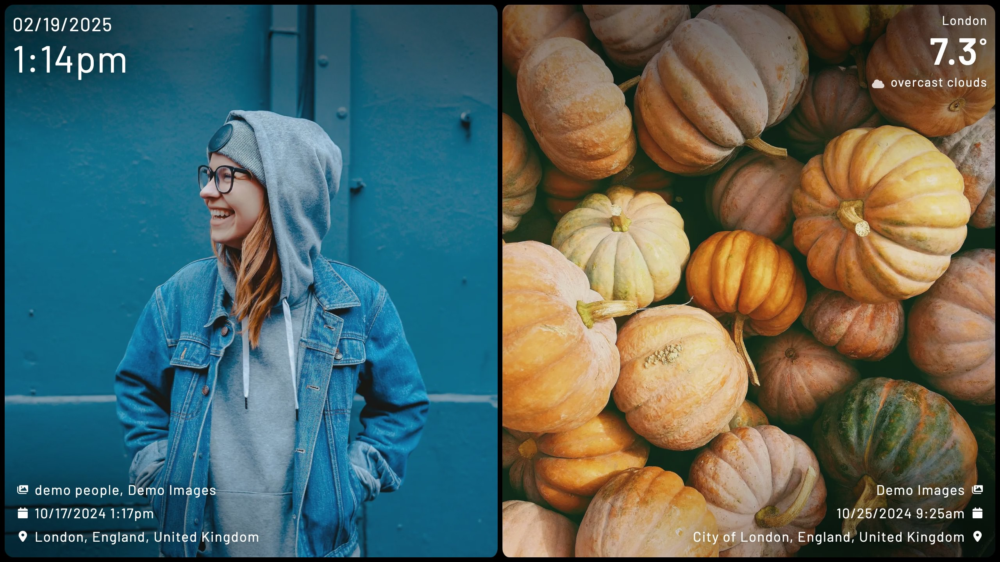

import { Aside } from '@astrojs/starlight/components';
import Settings from "../../../components/config-settings.astro";

<Aside type="note">
Throughout all layouts: Kiosk attempts to determine the orientation of each image. However, if an image lacks EXIF data, it may be displayed in an incorrect orientation (e.g., a portrait image shown in landscape format).
</Aside>

<Settings
    config="layout"
    env="KIOSK_LAYOUT"
    url="layout"
    value="single | portrait | landscape | splitview | splitview-landscape"
    defaultValue="single"
/>

### Single (the default)
This is the standard layout that displays one image at a time, regardless of orientation.
It works with both portrait and landscape images.

### Portrait
This layout displays one portrait-oriented image at a time.

### Landscape
This layout displays one landscape-oriented image at a time.

### Splitview
When a portrait image is fetched, Kiosk automatically retrieves a second portrait image\* and displays them side by side vertically. Landscape and square images are displayed individually. Will automatically switch to `layout=splitview-landscape` if the device or browser is in portrait orientation.

\* If Kiosk is unable to retrieve a second unique image, the first image will be displayed individually.

### Splitview landscape
When a landscape image is fetched, Kiosk automatically retrieves a second landscape image\* and displays them stacked horizontally. portrait and square images are displayed individually.

\* If Kiosk is unable to retrieve a second unique image, the first image will be displayed individually.
