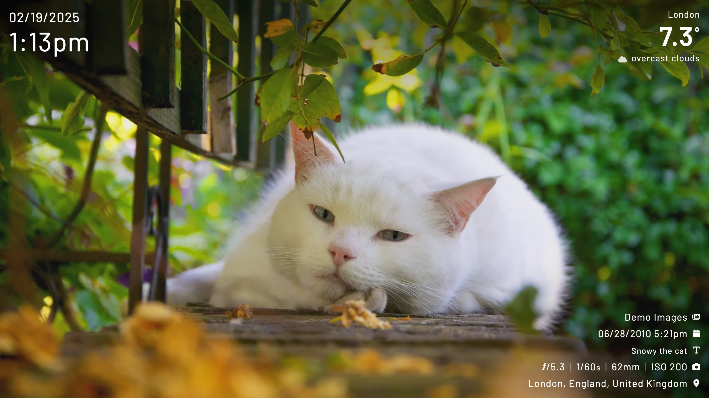

import { Aside } from '@astrojs/starlight/components';
import Settings from "../../../components/config-settings.astro";

## Theme

Which theme to use.

<Settings
    config="theme"
    env="KIOSK_THEME"
    url="theme"
    value="fade | solid"
    defaultValue="fade"
/>

### Fade (the default)
Soft gradient background for the clock and image metadata.

### Solid
Solid background for the clock and image metadata.

### Bubble
Display metadata in bubbles that use the dominant colour from the image.

