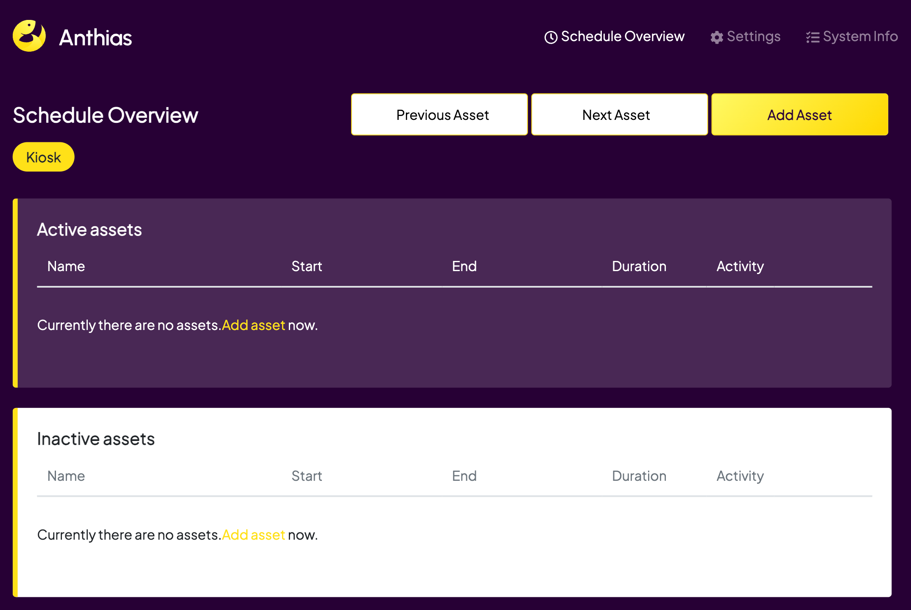
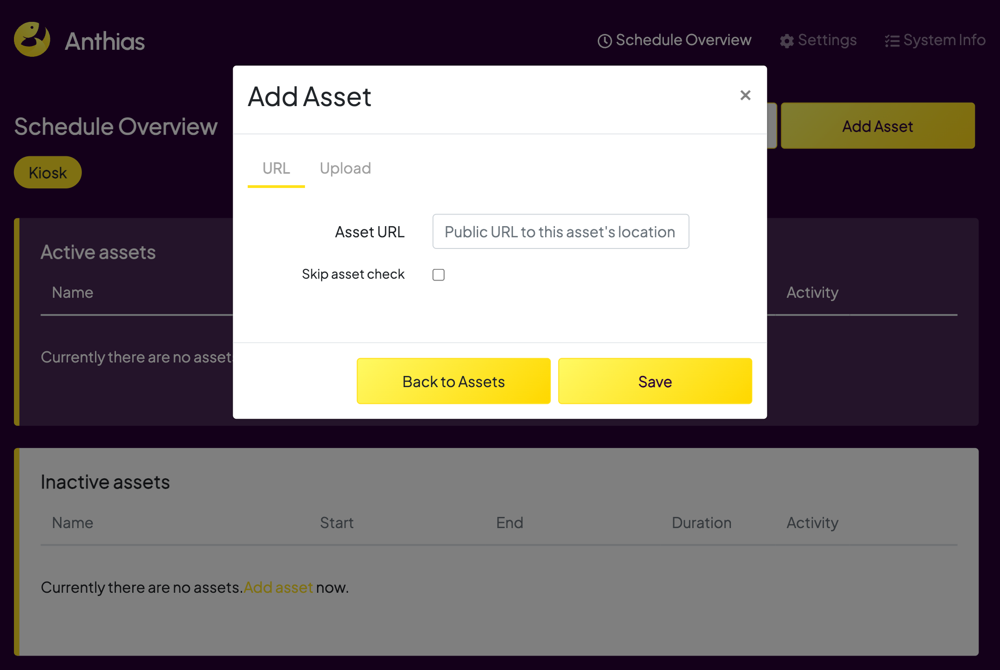

import { Steps, Aside } from '@astrojs/starlight/components';


<Aside type="caution">
    Anthias does not support user interaction. This means that you will not be able to interact with  Immich Kiosk using a touchscreen.
</Aside>

[Anthias](https://anthias.screenly.io/) is a popular open-source digital signage solution. It is typically ran on a Raspberry Pi which is what I will be using for this guide. This guide will walk you through the process of setting up Immich Kiosk with Anthias.

## Prerequisites

- Raspberry Pi
- A reachable Immich server
- A reachable Immich Kiosk server


## Installing Raspberry Pi OS

<Steps>

1. Install Raspberry Pi OS on your SD card using the [official Raspberry Pi Imager tool] (https://www.raspberrypi.com/software/). Follow the instructions provided by the tool to complete the installation process.

   For my installation I used these settings in the Raspberry Pi Imager tool:
   - Device: Raspberry Pi 3
   - OS: Raspberry Pi OS Lite (64-bit) `Raspberry Pi OS (other) -> Raspberry Pi OS Lite (64-bit)`
   - Storage: SD Card

2. Before writing to the SDcard click on the gear icon in the bottom right corner of the Raspberry Pi Imager tool. This will open the advanced options menu.

   Here you can add any Wifi networks that the Raspberry Pi should connect to automatically.

   you can also enable SSH access.

3. OPTIONAL: Raspberry Pi 7 touchscreen.

   As I am using the officail Raspberry Pi 7' touchscreen and the output was upside down, I needed to add this line to the `/boot/firmware/cmdline.txt` file:
   ```
   video=DSI-1:800x480@60,rotate=180
   ```

</Steps>


## Installing Anthias

<Steps>

1. SSH into the Raspberry Pi using the following command:
   ```sh
   ssh YOU_USERNAME@<Raspberry Pi IP Address>
   ```

2. Install Anthias using the following command:
   <Aside type="danger">
     I always recommend viewing a remote script before running it. You can do this by running the following command:
     ```sh
     curl -L https://install-anthias.srly.io
     ```
   </Aside>

   ```sh
   bash <(curl -sL https://install-anthias.srly.io)
   ```
3. Follow the onscreen prompts

4. Once the installation is complete you should be able to go to the IP address of your Raspberry Pi in your browser and see a screen like this.

   

5. You can add the url of your Immich Kiosk instance add clicking on the "Add asset" button and adding the url do the input field.

    

6. Toggle the "Activity" setting to add the URL to the active assets.

</Steps>
