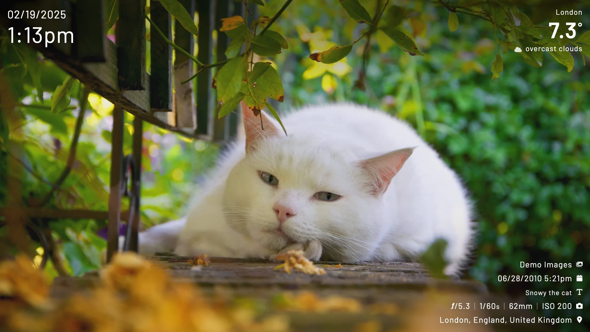
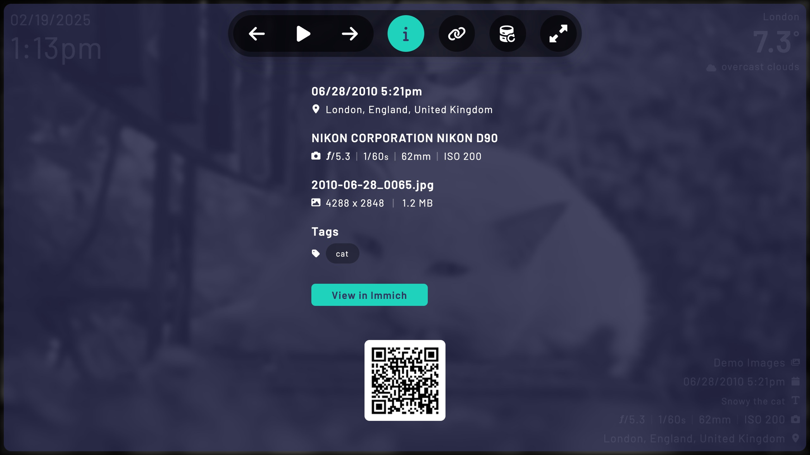
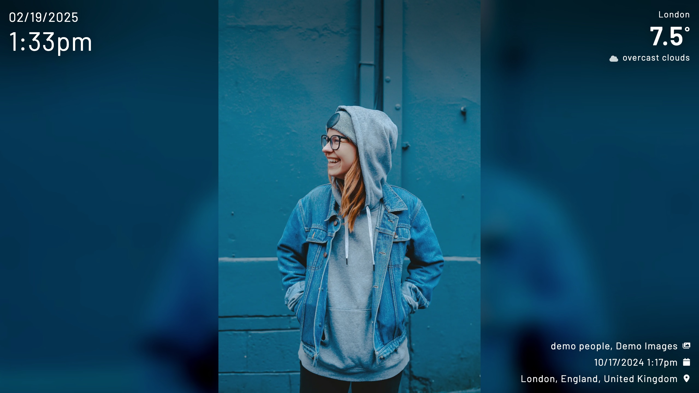
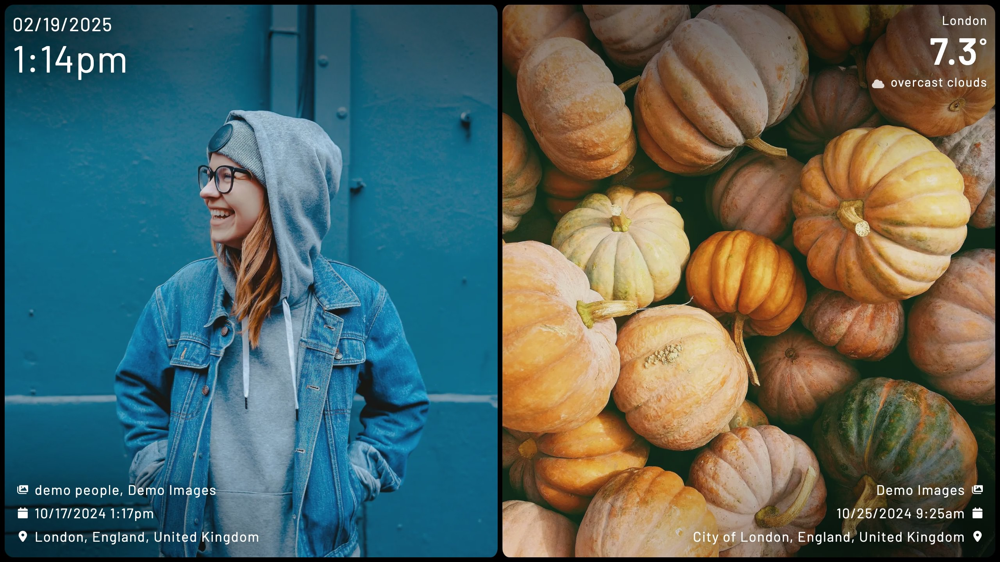

import { Aside } from '@astrojs/starlight/components';
import { LinkCard } from '@astrojs/starlight/components';
import  Acknowledgement from '../../components/acknowledgement.astro';

<Acknowledgement>
    Huge shoutout to the [Immich team](https://immich.app) for creating such an amazing product!
</Acknowledgement>

## What is Immich Kiosk?
Immich Kiosk is a lightweight slideshow for running on kiosk devices and browsers that uses [Immich](https://immich.app) as a data source.

<Aside type="note">
The default demo runs in Offline Mode with a limited set of images, which means you may notice some duplicate images.
</Aside>

Try the Immich Kiosk demo here: [demo.immichkiosk.app](https://demo.immichkiosk.app/)

Want to explore the features? You can:
1. Visit the [Immich demo instance](https://demo.immich.app/)
2. Log in to browse albums
3. Copy any album or people IDs to use in the kiosk demo e.g. `https://demo.immichkiosk.app?album=ALBUM_ID`

## Requirements
- A reachable Immich server that is running version v1.127.0 or above.
- A browser from [this supported list](https://browserslist.dev/?q=PiAwLjIl) or higher.

## Key features
- Simple installation and updates via Docker.
- Lightweight, responsive frontend for smooth performance.
- Display random images from your Immich collection, or curate specific albums and people.
- Fully customizable appearance with flexible transitions.
- Add a live clock with adjustable formats.
- Define default settings for all devices through environment variables or YAML config files.
- Configure device-specific settings using URL parameters.

**Image shot by Damon Golding**

**Image shot by Damon Golding**

**Image shot by [Toa Heftiba](https://unsplash.com/@heftiba)** using `layout=portrait` (portrait images only layout)

**Images shot by [Toa Heftiba](https://unsplash.com/@heftiba) (left) and [Kerstin Wrba](https://unsplash.com/@kerstinwrba) (right)** using `layout=splitview`

## Use Case Example 1
You have a two Raspberry Pi's. One hooked up to a LCD screen and the other you connect to your TV. You install a fullscreen browser OS or service on them (I use [DietPi](dietpi-url)).

You want the pi connected to the LCD screen to only show images from your recent holiday, which are stored in a album on Immich. It's an older pi so you want to disable CSS transitions, also we don't want to display the time of the image.

Using this URL `http://{URL}?album={ALBUM_ID}&transition=none&show_time=false` would achieve what we want.

On the pi connected to the TV you want to display a random image from your library but only images of two specific people. We want the image to cover the whole screen (knowing some cropping will happen) and we want to use the fade transition.

Using this URL `http://{URL}?image_fit=cover&transition=fade&person=PERSON_1_ID&person=PERSON_2_ID` would achieve what we want.

## Use Case Example 2
Fanyang Meng created a digital picture frame using a Raspberry Pi Zero 2 W and Kiosk. You can read the blog post about the process [here](https://fanyangmeng.blog/build-a-selfhosted-digital-frame/).

This example includes instructions on how to autoboot a Raspberry Pi directly into Immich Kiosk.
