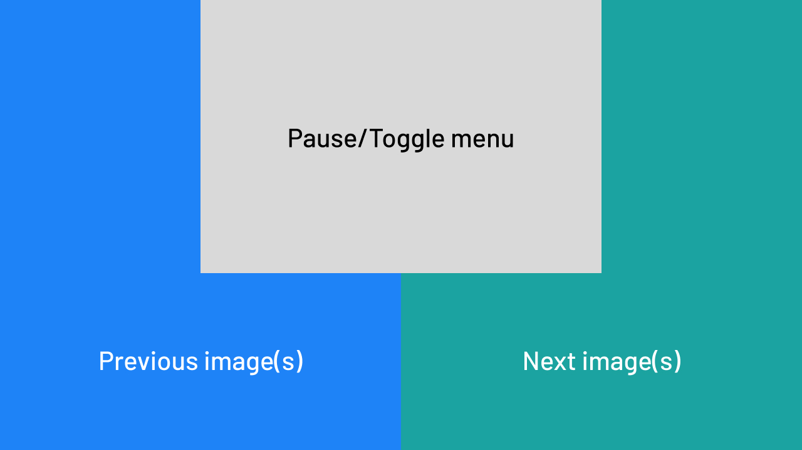

You can interact with Kiosk in three ways: touch, mouse, or keyboard.

## Touch & Click Zones

Kiosk's display is divided into interactive zones:

1. Left Side: Previous image(s)
2. Center top: Pause/Play and Toggle Menu
3. Right Side: Next image(s)

## Keyboard Shortcuts

| Key           | Action                                                   |
|---------------|----------------------------------------------------------|
| _ Spacebar    | Play/Pause and Toggle Menu                               |
| → Right Arrow | Next Image(s)                                            |
| ← Left Arrow  | Previous Image(s)                                        |
| i Key         | Play/Pause and Toggle Menu and display more info overlay |
| r Key         | Play/Pause and Toggle Menu and redirects info overlay    |
| p Key         | Pause and Toggle Menu and redirects info overlay         |
| shift+p Key   | Play and Toggle Menu and redirects info overlay          |
