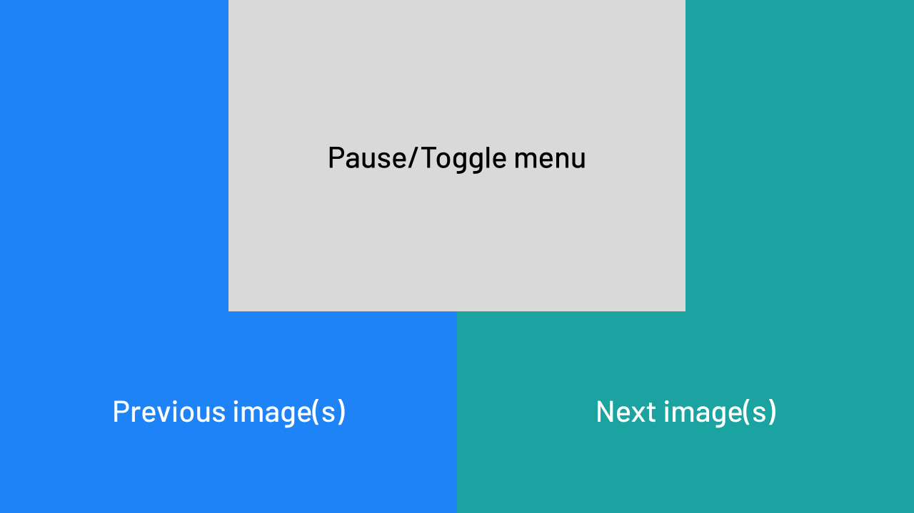

import Settings from "../../../components/config-settings.astro";

You can interact with Kiosk in three ways: touch, mouse, or keyboard.

## Touch & Click Zones

Kiosk's display is divided into interactive zones:

1. Left Side: Previous image(s)
2. Center top: Pause/Play and Toggle Menu
3. Right Side: Next image(s)

## Keyboard Shortcuts

| Key           | Action                                                   |
|---------------|----------------------------------------------------------|
| _ Spacebar    | Play/Pause and Toggle Menu                               |
| → Right Arrow | Next Image(s)                                            |
| ← Left Arrow  | Previous Image(s)                                        |
| i Key         | Play/Pause and Toggle Menu and display more info overlay |
| r Key         | Play/Pause and Toggle Menu and redirects info overlay    |
| p Key         | Pause and Toggle Menu and redirects info overlay         |
| shift+p Key   | Play and Toggle Menu and redirects info overlay          |
| f Key         | Toggle Fullscreen                                        |

## Custom Navigation

### Up Arrow

Bind a custom action to the keyboard up arrow.

Options:
 - "mute"
 - "redirects"
 - "pause"
 - "more-info"
 - "fullscreen"

<Settings
    config="up_arrow_action"
    env="KIOSK_UP_ARROW_ACTION"
    url="up_arrow_action"
    value="string"
    defaultValue=""
/>

### Down Arrow

Bind a custom action to the keyboard down arrow.

Options:
 - "mute"
 - "redirects"
 - "pause"
 - "more-info"
 - "fullscreen"

<Settings
    config="down_arrow_action"
    env="KIOSK_DOWN_ARROW_ACTION"
    url="down_arrow_action"
    value="string"
    defaultValue=""
/>
